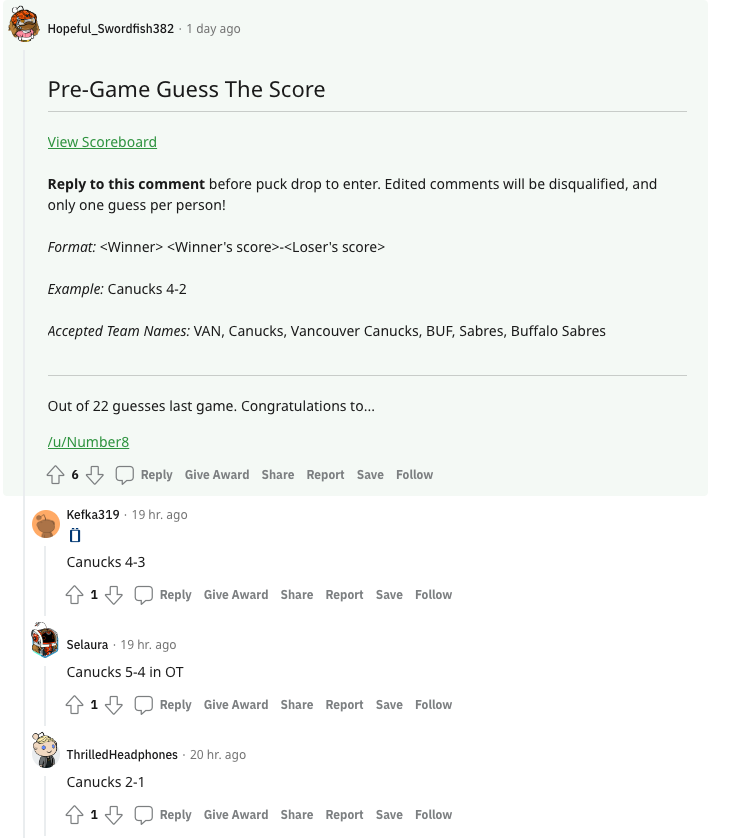
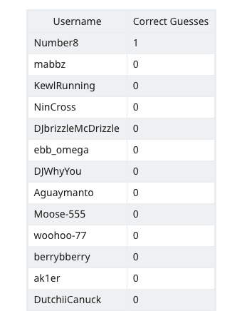

# Guess The Score

The following repository holds code for the reddit guess the score bot. 

For each NHL game, there is a game thread where users comment before, during, and after the game. This bot enhances these threads by allowing users to guess the score of NHL games prior to the match. If a user's guess is correct, they are given a point, and if they are incorrect they get no points. The point totals for each user are kept on a public scoreboard. This allows users to see how they are doing against other participants.

Guess The Score Post Example:



Scoreboard Example:



# How it works

The `guess_the_score.py` script setup to run once a day at roughly 10am PST. If there is a game, the guesses from the previous game are scored, the scoreboard is updated and the new guess the score comment is made.

- Run the script ONCE day, otherwise scores will be updated multiple times
- If there is no gamethread found, the scores will not be updated until the next game

# Set Up

1. First create a `keyconfig.json` file in the data folder, and fill out Reddit token information. This is how the application interacts with Reddit. More info -> [Getting Reddit Tokens](https://www.reddit.com/prefs/apps).

```
{
	"client-token": "",
	"client-id": "",
	"username": "",
	"password": ""
}
```

2. Run `./setup.sh` from the root directory

You can equally just run all the commands from this file individually. All these commands are setup for a Unix operating system.

If you get a `zsh: permission denied` error. First, run `chmod 755 setup.sh` to give the user execution permission.

3. Edit Scoreboard Information in guess_the_score.py

Line ~257: Change `prawtestenv` to the subreddit where the scoreboard is located. Change `index` to the name of the wiki.

When testing the bot, I created a new subreddit called /r/prawtestenv. This allowed me to test features that require moderator privileges (editing wiki pages, pinning comments). I would recommend doing this before deploying the bot into production.